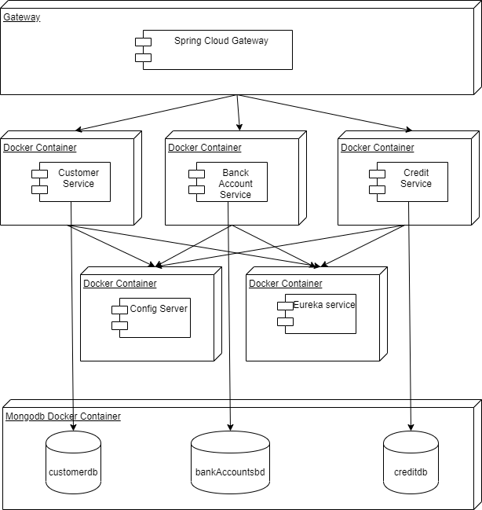

# Project4 updated - bank Accounts
Java Spring Boot Backend connected to mongodb.

### Command for run Dockerfile and start container
cd /bank-accounts

docker build -t "accounts"

docker run --restart always --name accounts -8080:9000 -d accounts:latest

### Using Docker Compose
cd /bank-accounts

docker-compose up -d

### Sonarqube
docker run -d --name sonarqube -p 8090:9000 sonarqube

## Arquitectura de Microservicio
